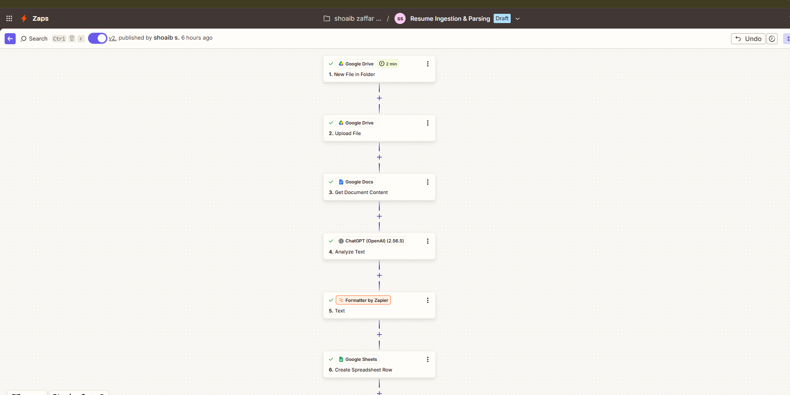
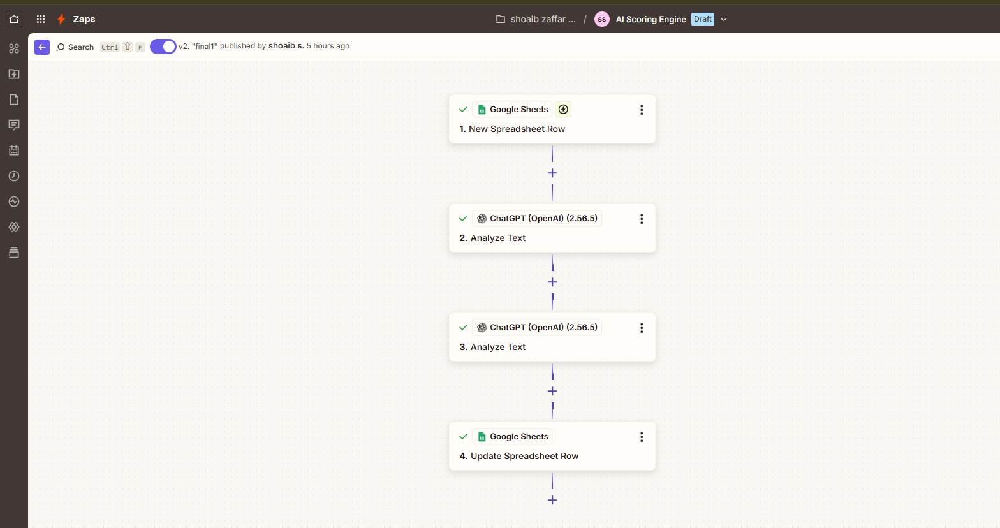
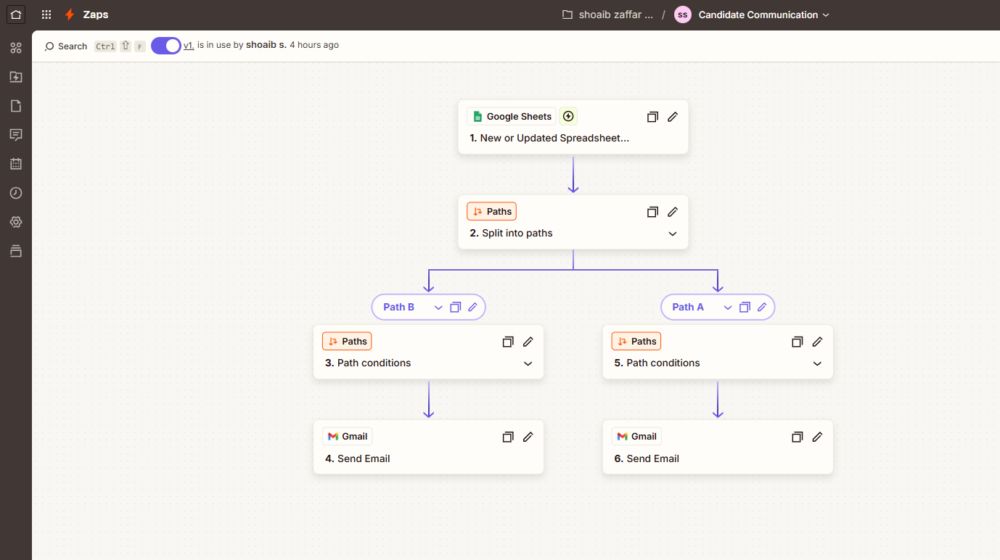
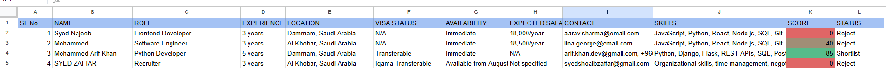

# AI-Powered Recruitment Automation System (Mini ATS)

##  Overview
This project is an AI-driven recruitment automation pipeline that scans resumes, extracts candidate data, evaluates profiles, and automates communication with applicants.

It replicates the core functionality of an Applicant Tracking System (ATS) using no-code tools.

---

##  Features

###  Resume Parsing
- Automatically reads PDF resumes from Google Drive  
- Extracts structured data (name, role, experience, skills, contact details)  

###  Candidate Database
- Stores all candidate data in Google Sheets  
- Automatically structures information for easy tracking  

###  AI Scoring System
- Evaluates candidates based on job requirements  
- Generates a score (0–100)  
- Classifies candidates as **Shortlisted** or **Rejected**  

###  Decision Automation
- Eliminates manual screening  
- Ensures consistent evaluation logic  

###  Automated Communication
- Sends interview emails to shortlisted candidates  
- Sends rejection emails to non-selected candidates  
- Maintains professional recruitment ethics  

---

##  Tech Stack
- Zapier  
- OpenAI  
- Google Sheets  
- Google Drive  
- Gmail  

---

##  Workflow

Resume Upload → AI Parsing → Data Structuring → Scoring → Decision → Email Automation

---

##  Screenshots

### 🔹 Resume Parsing Workflow

### 🔹 Scoring System Workflow

### 🔹 Email Automation Workflow

### 🔹 Final Candidate Database

---

##  Impact
- Reduced manual resume screening effort by **80%+**  
- Built a scalable hiring workflow  
- Ensured consistent candidate communication  
- Eliminated repetitive recruitment tasks  

---

##  Project Documentation
Detailed explanation available in:

**Syed Zafiar - Project - AI Recruitment automation system.pdf**

---

##  Key Learnings
- AI-based workflow automation  
- Prompt engineering for structured data extraction  
- No-code system design  
- Building real-world business solutions  

---

##  Future Enhancements
- Interview scheduling automation  
- Candidate ranking dashboard  
- Multi-role hiring system  
- Integration with ATS platforms  

---
